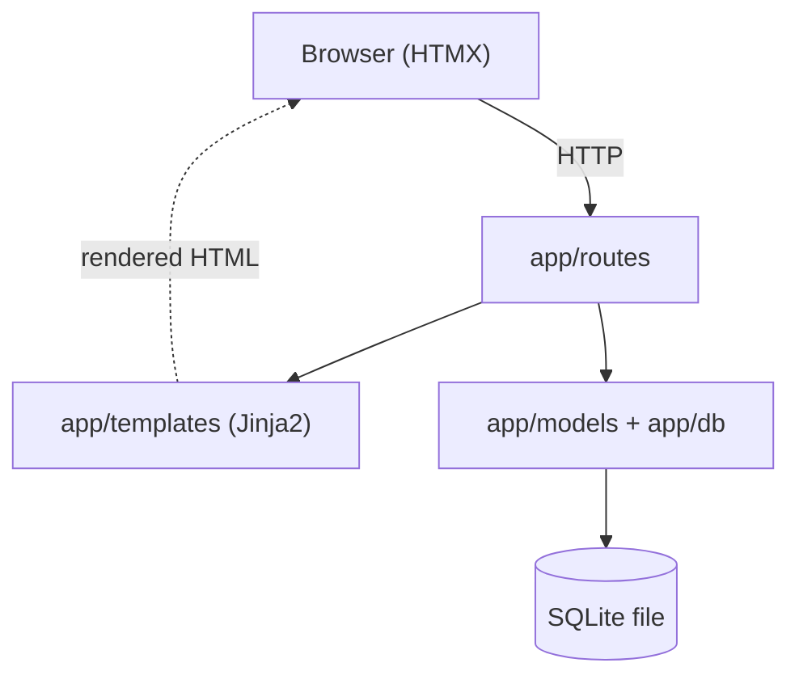
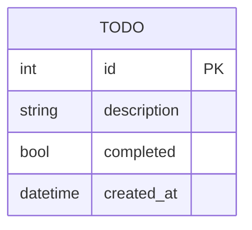

# Architecture Spine — Todo App

## Design Paradigm

**Server-rendered hypermedia monolith.** A single FastAPI application is the whole system: it owns the data, renders HTML, and handles every mutation. The browser is a thin hypermedia client — HTMX issues requests on user actions and swaps in the HTML fragments the server returns. There is no JSON SPA, no client-side state store, and no separate frontend build.

Layers map to directories inside one app:

| Layer | Directory | Responsibility |
| --- | --- | --- |
| Routes (HTTP + hypermedia) | `app/routes/` | Handle requests, orchestrate, return full pages or HTML fragments |
| Domain / persistence | `app/models.py`, `app/db.py` | The Todo entity and its storage; the only writer of state |
| Views | `app/templates/` | Jinja2 templates: full pages + swappable fragments |
| Static | `app/static/` | CSS and the HTMX script |

## Invariants & Rules

### AD-1 — Hypermedia monolith is the interaction paradigm  `[ADOPTED]`
- **Binds:** all UI interaction; FR-1..FR-7
- **Prevents:** one part built as a JSON-consuming SPA while another is server-rendered — two incompatible frontends.
- **Rule:** User actions are HTMX requests to FastAPI routes that return **HTML** (full page or fragment). No feature introduces a client-side framework, a client state store, or a JSON-only UI contract.

### AD-2 — One deployable process
- **Binds:** deployment topology; FR-8
- **Prevents:** a split frontend/backend deployment that must be run and versioned separately.
- **Rule:** A single FastAPI process serves both HTML routes and mutation endpoints. No separate frontend server or gateway in v1.

### AD-3 — SQLite is the single source of truth
- **Binds:** all Todo state; FR-2, FR-9
- **Prevents:** two owners of Todo data, or the browser holding authoritative state that drifts from storage.
- **Rule:** The backend is the **sole writer**. Persisted state lives only in SQLite. What the user sees is always a render of server state — the client caches nothing authoritative.

### AD-4 — All mutations flow through route handlers
- **Binds:** FR-1, FR-3, FR-4, FR-8
- **Prevents:** inconsistent write paths (e.g. a template or client script mutating data directly).
- **Rule:** Every create/toggle/delete goes: route handler → persistence write → return the updated HTML fragment. Templates never touch the DB; the client never mutates state except by calling a route.

### AD-5 — Errors cross the boundary uniformly
- **Binds:** FR-5, FR-7; all routes
- **Prevents:** each endpoint inventing its own failure behavior; blank/broken screens on error.
- **Rule:** A failed request returns a proper HTTP status **and** a rendered error fragment. The UI shows a non-disruptive message and stays usable; it never silently swallows or hard-crashes on a failure.

### AD-6 — No single-user assumption is hard-coded
- **Binds:** persistence schema and queries; PRD "must not preclude auth/multi-user"
- **Prevents:** baking single-user everywhere, forcing a rewrite when ownership is added later.
- **Rule:** The Todo store and its queries must accept an owner/user relationship being added later without restructuring. v1 has no user concept, but nothing may assume there can only ever be one.

### AD-7 — Fixed hypermedia fragment/swap contract
- **Binds:** all routes returning fragments; FR-1, FR-3, FR-4, FR-5
- **Prevents:** create/toggle/delete routes returning fragments the client cannot swap consistently (mismatched DOM ids or targets → broken UI updates).
- **Rule:** The list container has stable id `#todo-list`; each item fragment is a single root element with id `todo-&lt;id&gt;`. Mutation routes target these via consistent `hx-target`/`hx-swap`. New routes conform to this contract rather than inventing their own DOM shape.

### Dependency direction



*Dependencies point downward only: routes may depend on domain and templates; domain depends on nothing above it; templates never reach into the domain/DB.*

## Consistency Conventions

| Concern | Convention |
| --- | --- |
| Naming | Entity `Todo`; routes verb-scoped under `/todos`; fragment templates suffixed `_fragment.html`. |
| IDs | Server-generated integer primary key per Todo. |
| Dates | `created_at` stored UTC (ISO 8601). |
| Completion | Boolean `completed`; toggling is idempotent per target state. |
| Errors | HTTP status + rendered error fragment (AD-5); never a bare JSON error to the hypermedia client. |
| State / config | DB path and settings from environment/config, not hard-coded literals scattered in code. |

## Stack

*SEED — verified current 2026-07-14; the code owns exact pins once it exists.*

| Name | Version |
| --- | --- |
| Python | 3.12+ |
| FastAPI | 0.139.x |
| Uvicorn | current |
| Jinja2 | current |
| HTMX | 2.x |
| SQLAlchemy | 2.0.x |
| SQLite | stdlib (via SQLAlchemy) |

## Structural Seed

```text
nearform_python/
  app/
    main.py             # FastAPI app factory, mounts routes + static
    routes/
      todos.py          # create / list / toggle / delete → HTML fragments
    models.py           # Todo (SQLAlchemy 2.0 model)
    db.py               # engine, session, schema init
    templates/
      index.html        # full page: the Todo list
      _todo_item.html   # single-item fragment (swapped by HTMX)
      _error.html       # error fragment
    static/
      app.css           # responsive styling
      htmx.min.js        # vendored HTMX
  tests/
  pyproject.toml
```

### Core entity



*Owner/user relationship is intentionally absent in v1 but must be addable later (AD-6).*

## Capability → Architecture Map

| Capability (FR) | Lives in | Governed by |
| --- | --- | --- |
| FR-1 Create / FR-3 Toggle / FR-4 Delete | `app/routes/todos.py` → `models.py` | AD-4, AD-3 |
| FR-2 View list | `app/routes/todos.py` → `templates/index.html` | AD-1, AD-3 |
| FR-5 Instant feedback | HTMX fragment swaps from routes | AD-1, AD-4 |
| FR-6 Responsive layout | `templates/` + `static/app.css` | conventions |
| FR-7 Empty/loading/error states | `templates/` + `_error.html` | AD-5 |
| FR-8 CRUD API | `app/routes/todos.py` | AD-2, AD-4 |
| FR-9 Durable persistence | `app/db.py` → SQLite | AD-3 |

## Deferred

- **Styling system** — plain CSS assumed; a utility framework can be adopted later without touching the spine.
- **Migrations tooling** — v1 may create the schema on startup; Alembic can be introduced when the schema evolves.
- **Deployment target / hosting** — single uvicorn process + SQLite file assumed; a specific host, containerization, or managed DB is a later call.
- **Auth / multi-user** — explicitly out of v1 scope (PRD non-goal); AD-6 keeps the door open.
- **Testing framework specifics** — a `tests/` dir is seeded; framework choice deferred to implementation.
